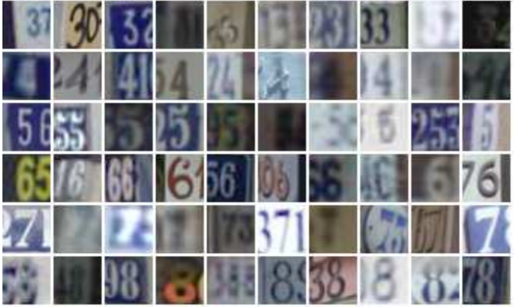
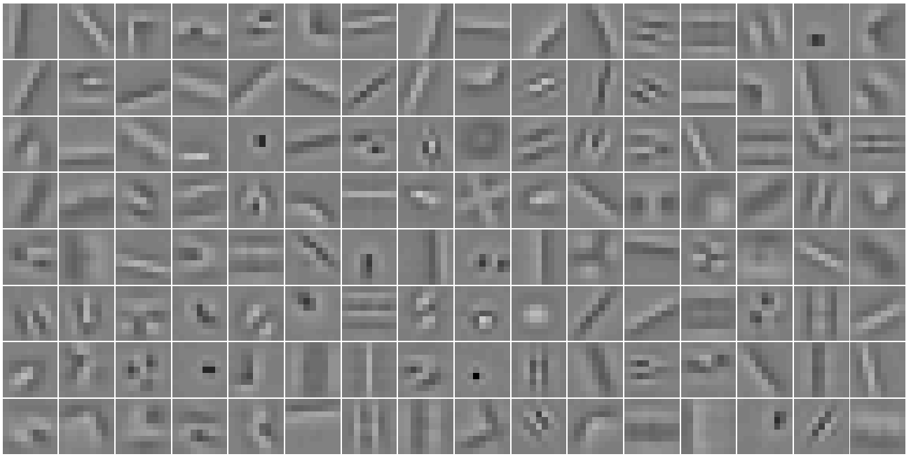
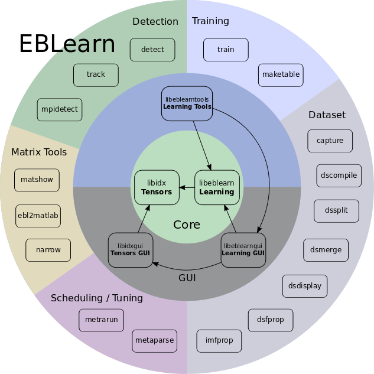

<table valign="top">
  <tr>
    <td class="project-fig">
<video class="b-lazy" data-src="assets/lmp/mp4/8tasks_cropped_640x180.mp4"
        type="video/mp4" autoplay muted playsinline loop style="display: block; width:100%;"></video>
</td>
    <td class="project-cell">
      
Learning Latent Plans from Play

      <dt-byline>

      <a class="project-link" href=https://learning-from-play.github.io>Project Page</a>
      <a class="project-link" href=https://arxiv.org/pdf/1903.01973.pdf>Paper</a>
      <a class="project-link" href=https://github.com/sermanet/sermanet.github.io/assets/bib/Lynch2019Play.bib>BibTex</a>
      

 
      FIXME In this work, we explore a new approach for robots to teach themselves about the world simply by observing it.
      In particular,  representations for continuous control tasks.
    </td>
  </tr>
  <!-- project block -->
  <tr>
    <td class="project-fig">
<video class="b-lazy" data-src="assets/misc/cheetah.mp4"
        type="video/mp4" autoplay muted playsinline loop style="display: block; width: 100%;"></video>
</td>
    <td class="project-cell">
      
Self-Supervised Actionable Representations

      <dt-byline>

      <a class="project-link" href=https://sites.google.com/view/actionablerepresentations/>Project Page</a>
      <a class="project-link" href=https://arxiv.org/abs/1808.00928>Paper</a>
      <a class="project-link" href=https://github.com/sermanet/sermanet.github.io/assets/bib/Dwibedi2018Learning.bib>BibTex</a>
      <a class="project-link" href=https://drive.google.com/file/d/1QkEnqApB7U7XvRBupfnysgdFMarhnwlP/view?usp=sharing>Video</a>
      <a class="project-link" href=https://docs.google.com/presentation/d/1okTa2eWg-BbjA7l1dHL8R_UWOmF5wSQ0HHm7A8NpvfM/edit?usp=sharing>Slides</a>
      

 
      FIXME In this work, we explore a new approach for robots to teach themselves about the world simply by observing it.
      In particular,  representations for continuous control tasks.
    </td>
  </tr>
  <!-- project block -->
  <tr>
    <td class="project-fig">

      <video class="b-lazy" data-src="assets/tcn/kuka_pouring_cropped960x540.mp4"
        type="video/mp4" autoplay muted playsinline loop style="display: block; width: 100%;"></video>
      <video class="b-lazy" data-src="assets/tcn/pose_all_cropped960x540.mp4"
        type="video/mp4" autoplay muted playsinline loop style="display: block; width: 100%;"></video>
    
</td>
    <td class="project-cell">
      
Time-Contrastive Networks (TCN)

      <dt-byline>

      <a class="project-link" href=https://sermanet.github.io/imitate>Project Page</a>
      <a class="project-link" href=https://arxiv.org/abs/1704.06888>Paper</a>
      <a class="project-link" href=https://github.com/sermanet/sermanet.github.io/assets/bib/Sermanet2017TCN.bib>BibTex</a>
      <a class="project-link" href=https://www.youtube.com/watch?v=b1UTUQpxPSY>Video</a>
      <a class="project-link" href=https://sites.google.com/site/brainrobotdata/home/multiview-pouring>Dataset</a>
      <a class="project-link" href=https://github.com/tensorflow/models/tree/master/research/tcn>Code</a>
      <a class="project-link" href=https://docs.google.com/presentation/d/1EvWSbsFfnceBpN7yG1wnqM2LxySQ0Gi-wTx6QaoVekY/edit?usp=sharing>Slides</a>
      

 
      Description.
    </td>
  </tr>
  <!-- project block -->
  <tr>
    <td class="project-fig">
<video class="b-lazy" data-src="assets/rewards/doors.mp4"
        type="video/mp4" autoplay muted playsinline loop style="display: block; width: 100%;"></video>
</td>
    <td class="project-cell">
      
Unsupervised Perceptual Rewards

      <dt-byline>

      <a class="project-link" href=https://sermanet.github.io/rewards>Project Page</a>
      <a class="project-link" href=https://arxiv.org/abs/1612.06699>Paper</a>
      <a class="project-link" href=https://github.com/sermanet/sermanet.github.io/assets/bib/Sermanet2017Rewards>BibTex</a>
      <a class="project-link" href=https://youtu.be/7f7sdLMCItg>Video</a>
      <a class="project-link" href=https://sites.google.com/site/brainrobotdata/home/pouring-dataset>Dataset</a>
      

 
      Description.
    </td>
  </tr>
  <!-- project block -->
  <tr>
    <td class="project-fig">
<video class="b-lazy" data-src="assets/misc/attention.mp4"
        type="video/mp4" autoplay muted playsinline loop style="display: block; width: 100%;"></video>
</td>
    <td class="project-cell">
      
Visual Attention

      <dt-byline>

      <a class="project-link" href=https://arxiv.org/abs/1412.7054>Paper</a>
      <a class="project-link" href=https://github.com/sermanet/sermanet.github.io/assets/bib/Sermanet2015Attention>BibTex</a>
      

 
      Description.
    </td>
  </tr>
  <!-- project block -->
  <tr>
    <td class="project-fig">

      
    
</td>
    <td class="project-cell">
      
Inception / GoogLeNet

      <dt-byline>

      <a class="project-link" href=https://www.cv-foundation.org/openaccess/content_cvpr_2015/papers/Szegedy_Going_Deeper_With_2015_CVPR_paper.pdf>Paper</a>
      <a class="project-link" href=https://github.com/sermanet/sermanet.github.io/assets/bib/Szegedy2015Inception.bib>BibTex</a>
      <a class="project-link" href=https://github.com/tensorflow/models/tree/master/research/inception>Code</a>
      <a class="project-link" href=http://www.image-net.org/challenges/LSVRC/2014/results>ImageNet Results</a>
      

 
      Description.
    </td>
  </tr>
  <!-- project block -->
  <tr>
    <td class="project-fig">

      
    
</td>
    <td class="project-cell">
      
Dogs vs. Cats Kaggle challenge

      <dt-byline>

      <a class="project-link" href=https://www.kaggle.com/c/dogs-vs-cats/leaderboard>Leaderboard</a>
      

 
      Description.
    </td>
  </tr>
  <!-- project block -->
  <tr>
    <td class="project-fig">

      
    
</td>
    <td class="project-cell">
      
OverFeat

      <dt-byline>

      <a class="project-link" href=https://github.com/sermanet/OverFeat>Code</a>
      <a class="project-link" href=https://arxiv.org/abs/1312.6229>Paper</a>
      <a class="project-link" href=https://github.com/sermanet/sermanet.github.io/assets/bib/Sermanet2014OverFeat.bib>BibTex</a>
      <a class="project-link" href=http://www.image-net.org/challenges/LSVRC/2013/results.php>ImageNet Results</a>
      <a class="project-link" href=http://www.image-net.org/challenges/LSVRC/2013/slides/overfeat_ilsvrc2013.pdf>Slides</a>
      <a class="project-link" href=https://machinelearning.apple.com/2017/11/16/face-detection.html>Press</a>
      

 
      Description.
    </td>
  </tr>
  <!-- project block -->
  <tr>
    <td class="project-fig">
<video class="b-lazy" data-src="assets/pedestrians/pedestrians_broadway480x360.mp4"
        type="video/mp4" autoplay muted playsinline loop style="display: block; width: 100%;"></video>
</td>
    <td class="project-cell">
      
Pedestrian Detection

      <dt-byline>

      <a class="project-link" href=https://www.cv-foundation.org/openaccess/content_cvpr_2013/html/Sermanet_Pedestrian_Detection_with_2013_CVPR_paper.html>Paper</a>
      <a class="project-link" href=https://github.com/sermanet/sermanet.github.io/assets/bib/Sermanet2013Pedestrian.bib>BibTex</a>
      <a class="project-link" href=https://www.youtube.com/watch?v=uKU2pzpGUlM>Video</a>
      

 
      Description.
    </td>
  </tr>
  <!-- project block -->
  <tr>
    <td class="project-fig">

      
    
</td>
    <td class="project-cell">
      
Convolutional Neural Networks Applied to House Numbers Digit Classification

      <dt-byline>

      <a class="project-link" href=https://arxiv.org/pdf/1204.3968.pdf>Paper</a>
      <a class="project-link" href=https://github.com/sermanet/sermanet.github.io/assets/bib/Sermanet2012Convolutional.bib>BibTex</a>
      

 
      Description.
    </td>
  </tr>
  <!-- project block -->
  <tr>
    <td class="project-fig">

       
      
    
</td>
    <td class="project-cell">
      
Traffic Sign Recognition

      <dt-byline>

      <a class="project-link" href=http://yann.lecun.com/exdb/publis/pdf/sermanet-ijcnn-11.pdf>Paper</a>
      <a class="project-link" href=https://github.com/sermanet/sermanet.github.io/assets/bib/Sermanet2011Traffic.bib>BibTex</a>
      

 
      Description.
    </td>
  </tr>
  <!-- project block -->
  <tr>
    <td class="project-fig">

      
    
</td>
    <td class="project-cell">
      
Unsupervised Convolutional Feature Hierarchies

      <dt-byline>

      <a class="project-link" href=http://papers.nips.cc/paper/4133-learning-convolutional-feature-hierarchies-for-visual-recognition.pdf>Paper</a>
      <a class="project-link" href=https://github.com/sermanet/sermanet.github.io/assets/bib/Kavukcuoglu2010Unsupervised.bib>BibTex</a>
      

 
      Description.
    </td>
  </tr>
  <!-- project block -->
  <tr>
    <td class="project-fig">

      
      
    
</td>
    <td class="project-cell">
      
EBLearn

      <dt-byline>

      <a class="project-link" href=http://eblearn.sourceforge.net/>Code</a>
      <a class="project-link" href=http://yann.lecun.com/exdb/publis/pdf/sermanet-ictai-09.pdf>Paper</a>
      <a class="project-link" href=https://github.com/sermanet/sermanet.github.io/assets/bib/Sermanet2009EBLearn.bib>BibTex</a>
      <a class="project-link" href=>Video</a>
      <a class="project-link" href=>Slides</a>
      

 
      Description.
    </td>
  </tr>
  <!-- project block -->
  <tr>
    <td class="project-fig">

      <video class="b-lazy" data-src="assets/nyu/rovio.mp4"
        type="video/mp4" autoplay muted playsinline loop style="display: block; width: 100%;"></video>
      <video class="b-lazy" data-src="assets/nyu/3pi.mp4"
        type="video/mp4" autoplay muted playsinline loop style="display: block; width: 100%;"></video>
    
</td>
    <td class="project-cell">
      
TA for NYU Robotics class

      <dt-byline>

      <a class="project-link" href=https://cs.nyu.edu/~yann/2009s-V22-0480-001/index.html>Class Page</a>
      

 
      Description.
    </td>
  </tr>
  <!-- project block -->
  <tr>
    <td class="project-fig">

      
    
</td>
    <td class="project-cell">
      
LAGR Challenge: Learning Applied to Ground Robots

      <dt-byline>

      <a class="project-link" href=https://cs.nyu.edu/~yann/research/lagr/index.html>Project Page</a>
      <a class="project-link" href=https://www.youtube.com/watch?v=lowcgokiRG8>Video</a>
      

 
      Description.
    </td>
  </tr>
  <!-- project block -->
  <tr>
    <td class="project-fig">
<video class="b-lazy" data-src="assets/"
        type="video/mp4" autoplay muted playsinline loop style="display: block; width: 100%;"></video>
</td>
    <td class="project-cell">
      
Learning Long-Range Vision for Autonomous Off-Road Driving

      <dt-byline>

      <a class="project-link" href=http://www.cs.nyu.edu/~sermanet/lagr/papers/hadsell-jfr-09_wiley.pdf>Paper</a>
      <a class="project-link" href=https://github.com/sermanet/sermanet.github.io/assets/bib/Hadsell2009Learning.bib>BibTex</a>
      

 
      Description.
    </td>
  </tr>
  <!-- project block -->
  <tr>
    <td class="project-fig">
<video class="b-lazy" data-src="assets/"
        type="video/mp4" autoplay muted playsinline loop style="display: block; width: 100%;"></video>
</td>
    <td class="project-cell">
      
Collision-Free Off-Road Robot Navigation

      <dt-byline>

      <a class="project-link" href=https://cs.nyu.edu/~sermanet/lagr/papers/sermanet-jfr-09_wiley.pdf>Paper</a>
      <a class="project-link" href=https://github.com/sermanet/sermanet.github.io/assets/bib/Sermanet2009Multirange.bib>BibTex</a>
      

 
      Description.
    </td>
  </tr>
  <!-- project block -->
  <tr>
    <td class="project-fig">

      
    
</td>
    <td class="project-cell">
      
Learning Maneuver Dictionaries for Ground Robot Planning

      <dt-byline>

      <a class="project-link" href=>Project Page</a>
      <a class="project-link" href=http://yann.lecun.com/exdb/publis/pdf/sermanet-isr-08.pdf>Paper</a>
      <a class="project-link" href=https://github.com/sermanet/sermanet.github.io/assets/bib/Sermanet2008Learning>BibTex</a>
      

 
      Description.
    </td>
  </tr>
  <!-- project block -->
  <tr>
    <td class="project-fig">
<video class="b-lazy" data-src="assets/"
        type="video/mp4" autoplay muted playsinline loop style="display: block; width: 100%;"></video>
</td>
    <td class="project-cell">
      
Mapping and Planning under Uncertainty in Mobile Robots with Long-Range Perception

      <dt-byline>

      <a class="project-link" href=http://yann.lecun.com/exdb/publis/pdf/sermanet-iros-08.pdf>Paper</a>
      <a class="project-link" href=https://github.com/sermanet/sermanet.github.io/assets/bib/Sermanet2008Mapping.bib>BibTex</a>
      

 
      Description.
    </td>
  </tr>
  <!-- project block -->
  <tr>
    <td class="project-fig">

      
    
</td>
    <td class="project-cell">
      
Deep Belief Net Learning in a Long-Range Vision System

      <dt-byline>

      <a class="project-link" href=https://cs.nyu.edu/~naz/docs/iros08.pdf>Paper</a>
      <a class="project-link" href=https://github.com/sermanet/sermanet.github.io/assets/bib/Hadsell2008Deep.bib>BibTex</a>
      

 
      Description.
    </td>
  </tr>
  <!-- project block -->
  <tr>
    <td class="project-fig">

      
    
</td>
    <td class="project-cell">
      
Online Learning for Offroad Robots

      <dt-byline>

      <a class="project-link" href=http://yann.lecun.com/exdb/publis/pdf/hadsell-rss-07.pdf>Paper</a>
      <a class="project-link" href=https://github.com/sermanet/sermanet.github.io/assets/bib/Hadsell2007Online.bib>BibTex</a>
      

 
      Description.
    </td>
  </tr>
  <!-- project block -->
  <tr>
    <td class="project-fig">
<video class="b-lazy" data-src="assets/eurobot/robot_hangs_out2.mp4"
        type="video/mp4" autoplay muted playsinline loop style="display: block; width: 100%;"></video>
</td>
    <td class="project-cell">
      
EUROBOT Competition

      <dt-byline>

      <a class="project-link" href=https://sermanet.github.io/eurobot>Project Page</a>
      

 
      Description.
    </td>
  </tr>
  <!-- <\!-- project block -\-> -->
  <!-- <tr> -->
  <!--   <td class="project-fig">
<video class="b-lazy" data-src="assets/" -->
  <!--       type="video/mp4" autoplay muted playsinline loop style="display: block; width: 100%;"></video>
</td> -->
  <!--   <td class="project-cell"> -->
  <!--     

 -->
  <!--     <dt-byline>
 -->
  <!--     <a class="project-link" href=>Project Page</a> -->
  <!--     <a class="project-link" href=>Paper</a> -->
  <!--     <a class="project-link" href=https://github.com/sermanet/sermanet.github.io/assets/bib/>BibTex</a> -->
  <!--     <a class="project-link" href=>Video</a> -->
  <!--     <a class="project-link" href=>Slides</a> -->
  <!--     

  -->
  <!--     Description. -->
  <!--   </td> -->
  <!-- </tr> -->

</table>
