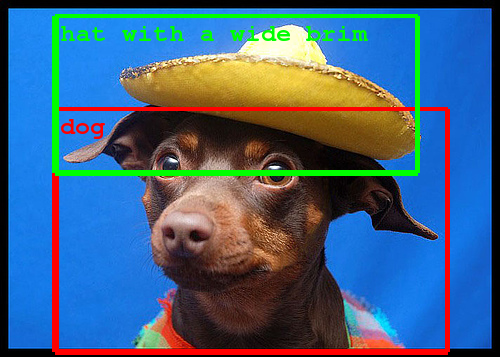
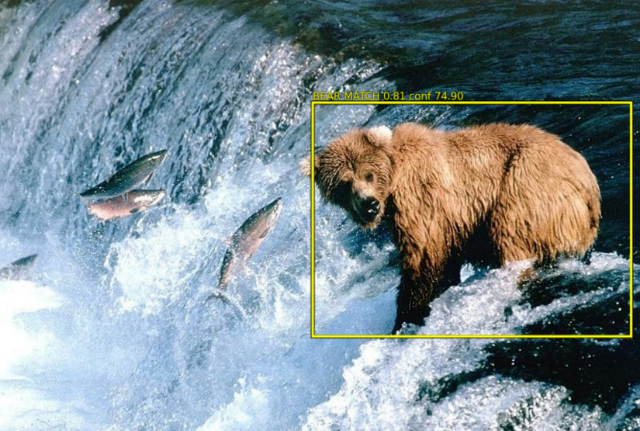
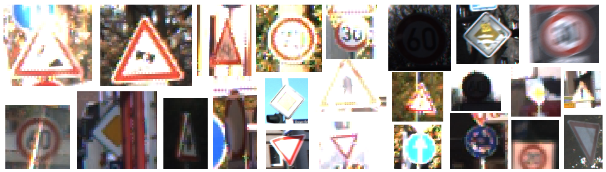
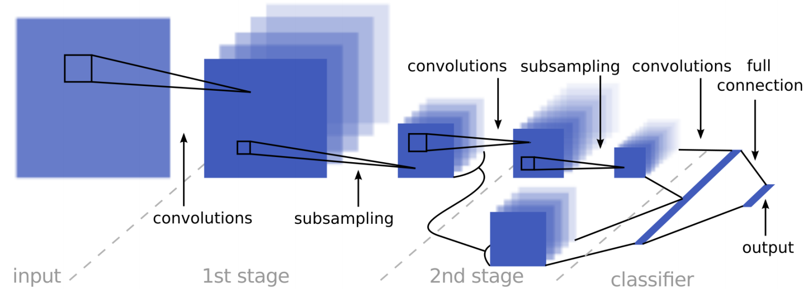
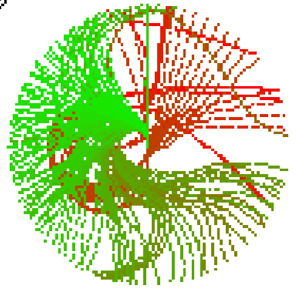

<table valign="top">
  <tr>
    <td class="project-fig">
<video class="b-lazy" data-src="assets/langlfp/playlang_20200326-193259_13tasks_bt300k.mp4"
        type="video/mp4" autoplay muted playsinline loop style="display: block; width:100%;"></video>
</td>
    <td class="project-cell">
      
Grounding Language in Play

      <dt-byline>

      <a class="project-link" href=https://language-play.github.io>Project Page</a>
      <a class="project-link" href=https://arxiv.org/pdf/2005.07648.pdf>Paper</a>
      <a class="project-link" href=https://github.com/sermanet/sermanet.github.io/blob/master/assets/bib/Lynch2020Language.bib>BibTex</a>
      

 
      Corey Lynch and Pierre Sermanet
        
      We present a simple and scalable approach for controlling robots with natural language: play through teleoperation, then answer “how do I go from start to finish?” for random episodes. We can then type in commands in real time.
        By hooking up our English-trained model with a pre-trained language embedding trained on lots of text and different languages, it not only improves control but also allows commanding the model in 16 languages.
        Combining natural language with play provides a breadth of skills while having no tasks determined in advance. This yields flexible specification of tasks, for example we can compose tasks on the fly: “pick up the object”, then “put the object in the trash”.
    </td>
  </tr>
  <!-- project block -->
  <tr>
    <td class="project-fig">
<video class="b-lazy" data-src="assets/lmp/mp4/8tasks_cropped_640x180.mp4"
        type="video/mp4" autoplay muted playsinline loop style="display: block; width:100%;"></video>
</td>
    <td class="project-cell">
      
Learning Latent Plans from Play

      <dt-byline>

      <a class="project-link" href=https://learning-from-play.github.io>Project Page</a>
      <a class="project-link" href=https://arxiv.org/pdf/1903.01973.pdf>Paper</a>
      <a class="project-link" href=https://github.com/sermanet/sermanet.github.io/blob/master/assets/bib/Lynch2019Play.bib>BibTex</a>
      

 
      Corey Lynch, Mohi Khansari, Ted Xiao, Vikash Kumar, Jonathan Tompson, Sergey Levine, Pierre Sermanet
        
      How to scale-up multi-task learning? 
      Self-supervise plan representations from lots of cheap unlabeled play data (no RL was used).
    </td>
  </tr>
  <!-- project block -->
  <tr>
    <td class="project-fig">

      <video class="b-lazy" data-src="assets/mftcn/cheetah.mp4"
        type="video/mp4" autoplay muted playsinline loop style="display: block; width: 100%;"></video>
      
    
</td>
    <td class="project-cell">
      
Self-Supervised Actionable Representations

      <dt-byline>

      <a class="project-link" href=https://sites.google.com/view/actionablerepresentations/>Project Page</a>
      <a class="project-link" href=https://arxiv.org/abs/1808.00928>Paper</a>
      <a class="project-link" href=https://github.com/sermanet/sermanet.github.io/blob/master/assets/bib/Dwibedi2018Learning.bib>BibTex</a>
      <a class="project-link" href=https://drive.google.com/file/d/1QkEnqApB7U7XvRBupfnysgdFMarhnwlP/view?usp=sharing>Video</a>
      <a class="project-link" href=https://docs.google.com/presentation/d/1okTa2eWg-BbjA7l1dHL8R_UWOmF5wSQ0HHm7A8NpvfM/edit?usp=sharing>Slides</a>
      

 
      Debidatta Dwibedi, Jonathan Tompson, Corey Lynch, Pierre Sermanet @ IROS 2018
        
      We learn continuous control entirely from raw pixels. 
      We use a multi-frame TCN to self-supervise task-agnostic representations from vision only, using 2 slightly different views of the cheetah. 
      Then using RL on top of our embeddings we learn the cheetah task almost as well as if we were using the true proprioceptive states of the cheetah.
    </td>
  </tr>
  <!-- project block -->
  <tr>
    <td class="project-fig">

      <video class="b-lazy" data-src="assets/tcn/kuka_pouring_cropped960x540.mp4"
        type="video/mp4" autoplay muted playsinline loop style="display: block; width: 100%;"></video>
         
      <video class="b-lazy" data-src="assets/tcn/pose_all_cropped960x540.mp4"
        type="video/mp4" autoplay muted playsinline loop style="display: block; width: 100%;"></video>
    
</td>
    <td class="project-cell">
      
Time-Contrastive Networks (TCN)

      <dt-byline>

      <a class="project-link" href=https://sermanet.github.io/imitate>Project Page</a>
      <a class="project-link" href=https://arxiv.org/abs/1704.06888>Paper</a>
      <a class="project-link" href=https://github.com/sermanet/sermanet.github.io/blob/master/assets/bib/Sermanet2017TCN.bib>BibTex</a>
      <a class="project-link" href=https://www.youtube.com/watch?v=b1UTUQpxPSY>Video</a>
      <a class="project-link" href=https://sites.google.com/site/brainrobotdata/home/multiview-pouring>Dataset</a>
      <a class="project-link" href=https://github.com/tensorflow/models/tree/master/research/tcn>Code</a>
      <a class="project-link" href=https://docs.google.com/presentation/d/1EvWSbsFfnceBpN7yG1wnqM2LxySQ0Gi-wTx6QaoVekY/edit?usp=sharing>Slides</a>
      <a class="project-link" href=https://ai.googleblog.com/2017/07/teaching-robots-to-understand-semantic.html>Blogpost</a>
      

 
      Pierre Sermanet, Corey Lynch, Yevgen Chebotar, Jasmine Hsu, Eric Jang, Stefan Schaal, Sergey Levine @ ICRA 2018
        
      We propose a general self-supervised method for learning representations from raw unlabeled videos. 
      We show that the self-supervised representations are rich enough to perform robotic tasks. 
       
      We use the distance in our learned embedding space to a video demonstration as a reward. An RL algorithm can learn to perform a pouring task using this reward.
      The robot has learned to pour in only 9 iterations using a single video demonstration, while never receiving any labels. 
       
      We also show that a robot can teach itself how to imitate people: by training a single TCN on videos of both humans and robots peforming random motions, the TCN model is able to find correspondences between humans and robots, despite never being given any label correspondences.
    </td>
  </tr>
  <!-- project block -->
  <tr>
    <td class="project-fig">

      <video class="b-lazy" data-src="assets/rewards/doors.mp4"
        type="video/mp4" autoplay muted playsinline loop style="display: block; width: 100%;"></video>
         
      
    
</td>
    <td class="project-cell">
      
Unsupervised Perceptual Rewards

      <dt-byline>

      <a class="project-link" href=https://sermanet.github.io/rewards>Project Page</a>
      <a class="project-link" href=https://arxiv.org/abs/1612.06699>Paper</a>
      <a class="project-link" href=https://github.com/sermanet/sermanet.github.io/blob/master/assets/bib/Sermanet2017Rewards.bib>BibTex</a>
      <a class="project-link" href=https://youtu.be/7f7sdLMCItg>Video</a>
      <a class="project-link" href=https://sites.google.com/site/brainrobotdata/home/pouring-dataset>Dataset</a>
      <a class="project-link" href=https://ai.googleblog.com/2017/07/teaching-robots-to-understand-semantic.html>Blogpost</a>
      

 
      Pierre Sermanet, Kelvin Xu, Sergey Levine @ RSS 2017
        
      We propose learning unsupervised perceptual rewards that can be fed to an RL system and show it is able to learn a robotic task such as door opening from a few human demonstrations.
    </td>
  </tr>
  <!-- project block -->
  <tr>
    <td class="project-fig">
<video class="b-lazy" data-src="assets/misc/attention.mp4"
        type="video/mp4" autoplay muted playsinline loop style="display: block; width: 100%;"></video>
</td>
    <td class="project-cell">
      
Visual Attention

      <dt-byline>

      <a class="project-link" href=https://arxiv.org/abs/1412.7054>Paper</a>
      <a class="project-link" href=https://github.com/sermanet/sermanet.github.io/blob/master/assets/bib/Sermanet2015Attention.bib>BibTex</a>
      

 
      Pierre Sermanet, Andrea Frome, Esteban Real @ ICLR 2015 (workshop)
        
      We demonstrate a foveated attention RNN that is able to perform fine-grained classification. 
      Tracking naturally emerges from our fovated model when ran on videos, even though it was only trained on still images.
    </td>
  </tr>
  <!-- project block -->
  <tr>
    <td class="project-fig">

      
      
    
</td>
    <td class="project-cell">
      
Inception / GoogLeNet

      <dt-byline>

      <a class="project-link" href=https://www.cv-foundation.org/openaccess/content_cvpr_2015/papers/Szegedy_Going_Deeper_With_2015_CVPR_paper.pdf>Paper</a>
      <a class="project-link" href=https://github.com/sermanet/sermanet.github.io/blob/master/assets/bib/Szegedy2015Inception.bib>BibTex</a>
      <a class="project-link" href=https://github.com/tensorflow/models/tree/master/research/inception>Code</a>
      <a class="project-link" href=http://www.image-net.org/challenges/LSVRC/2014/results>ImageNet Results</a>
      <a class="project-link" href=https://ai.googleblog.com/2014/09/building-deeper-understanding-of-images.html>Blogpost</a>
      

 
      Christian Szegedy, Wei Liu, Yangqing Jia, Pierre Sermanet, Scott Reed, Dragomir Anguelov, Dumitru Erhan, Vincent Vanhoucke, Andrew Rabinovich @ CVPR 2015
        
      A deep architecture for computer vision. Our model obtained 1st place for the classification and detection tasks in the 2014 ImageNet Challenge.
    </td>
  </tr>
  <!-- project block -->
  <tr>
    <td class="project-fig">

      
    
</td>
    <td class="project-cell">
      
Dogs vs. Cats Kaggle challenge

      <dt-byline>

      <a class="project-link" href=https://www.kaggle.com/c/dogs-vs-cats/leaderboard>Leaderboard</a>
      

 
      Pierre Sermanet (2014)
        
      1st place in an image classification Kaggle challenge between dog and cat images. Most of the top entries are based on our OverFeat model.
    </td>
  </tr>
  <!-- project block -->
  <tr>
    <td class="project-fig">

      
      
    
</td>
    <td class="project-cell">
      
OverFeat

      <dt-byline>

      <a class="project-link" href=https://github.com/sermanet/OverFeat>Code</a>
      <a class="project-link" href=https://arxiv.org/abs/1312.6229>Paper</a>
      <a class="project-link" href=https://github.com/sermanet/sermanet.github.io/blob/master/assets/bib/Sermanet2014OverFeat.bib>BibTex</a>
      <a class="project-link" href=http://www.image-net.org/challenges/LSVRC/2013/results.php>ImageNet Results</a>
      <a class="project-link" href=http://www.image-net.org/challenges/LSVRC/2013/slides/overfeat_ilsvrc2013.pdf>Slides</a>
      <a class="project-link" href=https://machinelearning.apple.com/2017/11/16/face-detection.html>Press</a>
      

 
      Pierre Sermanet, David Eigen, Xiang Zhang, Michael Mathieu, Rob Fergus, Yann LeCun @ ICLR 2014
        
      This model obtained 1st place in the 2013 ImageNet object localization challenge. The model and pre-trained features were later released to the public.
        
      Overfeat has been used by Apple for on-device face detection in iPhones: <a class="project-link" href=https://machinelearning.apple.com/2017/11/16/face-detection.html>blogpost</a>
    </td>
  </tr>
  <!-- project block -->
  <tr>
    <td class="project-fig">
<video class="b-lazy" data-src="assets/pedestrians/pedestrians_broadway480x360.mp4"
        type="video/mp4" autoplay muted playsinline loop style="display: block; width: 100%;"></video>
</td>
    <td class="project-cell">
      
Pedestrian Detection

      <dt-byline>

      <a class="project-link" href=https://www.cv-foundation.org/openaccess/content_cvpr_2013/html/Sermanet_Pedestrian_Detection_with_2013_CVPR_paper.html>Paper</a>
      <a class="project-link" href=https://github.com/sermanet/sermanet.github.io/blob/master/assets/bib/Sermanet2013Pedestrian.bib>BibTex</a>
      <a class="project-link" href=https://www.youtube.com/watch?v=uKU2pzpGUlM>Video</a>
      

 
      Pierre Sermanet, Koray Kavukcuoglu, Soumith Chintala, Yann Lecun @ CVPR 2013
        
      State of the art results on pedestrian detection datasets using deep ConvNets in the EBLearn framework.
    </td>
  </tr>
  <!-- project block -->
  <tr>
    <td class="project-fig">

      
    
</td>
    <td class="project-cell">
      
Convolutional Neural Networks Applied to House Numbers Digit Classification

      <dt-byline>

      <a class="project-link" href=https://arxiv.org/pdf/1204.3968.pdf>Paper</a>
      <a class="project-link" href=https://github.com/sermanet/sermanet.github.io/blob/master/assets/bib/Sermanet2012Convolutional.bib>BibTex</a>
      

 
      Pierre Sermanet, Soumith Chintala, Yann LeCun @ ICPR 2012
        
      State of the art results in house numbers classification using deep ConvNets.
    </td>
  </tr>
  <!-- project block -->
  <tr>
    <td class="project-fig">

       
      
    
</td>
    <td class="project-cell">
      
Traffic Sign Recognition

      <dt-byline>

      <a class="project-link" href=http://yann.lecun.com/exdb/publis/pdf/sermanet-ijcnn-11.pdf>Paper</a>
      <a class="project-link" href=https://github.com/sermanet/sermanet.github.io/blob/master/assets/bib/Sermanet2011Traffic.bib>BibTex</a>
      

 
      Pierre Sermanet, Yann LeCun @ IJCNN 2011
        
      This deep model obtained 2nd place in a traffic sign recognition challenge using the EBLearn framework. It uses skip connections in deep ConvNets to better combine low-lvel and high-level learned features.
    </td>
  </tr>
  <!-- project block -->
  <tr>
    <td class="project-fig">

      
    
</td>
    <td class="project-cell">
      
Unsupervised Convolutional Feature Hierarchies

      <dt-byline>

      <a class="project-link" href=http://papers.nips.cc/paper/4133-learning-convolutional-feature-hierarchies-for-visual-recognition.pdf>Paper</a>
      <a class="project-link" href=https://github.com/sermanet/sermanet.github.io/blob/master/assets/bib/Kavukcuoglu2010Unsupervised.bib>BibTex</a>
      

 
      Koray Kavukcuoglu, Pierre Sermanet, Y-Lan Boureau, Karol Gregor, Michael Mathieu, Yann LeCun @ NIPS 2010
        
      An unsupervised method for learning multi-stage hierarchies of sparse convolutional features. One of the few instances of this period where unsupervised pretraining improved results in a supervised task.
    </td>
  </tr>
  <!-- project block -->
  <tr>
    <td class="project-fig">

      
      
    
</td>
    <td class="project-cell">
      
EBLearn

      <dt-byline>

      <a class="project-link" href=http://eblearn.sourceforge.net/>Code</a>
      <a class="project-link" href=http://yann.lecun.com/exdb/publis/pdf/sermanet-ictai-09.pdf>Paper</a>
      <a class="project-link" href=https://github.com/sermanet/sermanet.github.io/blob/master/assets/bib/Sermanet2009EBLearn.bib>BibTex</a>
      

 
      Pierre Sermanet, Koray Kavukcuoglu, Yann LeCun @ ICTAI 2009 
      Additional help from Soumith Chintala.
        
      A C++ deep learning framework similar to Torch and used for multiple state of the art results in computer vision.
    </td>
  </tr>
  <!-- project block -->
  <tr>
    <td class="project-fig">

      <video class="b-lazy" data-src="assets/nyu/rovio.mp4"
        type="video/mp4" autoplay muted playsinline loop style="display: block; width: 100%;"></video>
      <video class="b-lazy" data-src="assets/nyu/3pi.mp4"
        type="video/mp4" autoplay muted playsinline loop style="display: block; width: 100%;"></video>
    
</td>
    <td class="project-cell">
      
Teaching Assitant for NYU Robotics class

      <dt-byline>

      <a class="project-link" href=https://cs.nyu.edu/~yann/2009s-V22-0480-001/index.html>Class Page</a>
      

 
      Pierre Sermanet, Yann LeCun (2009)  
    </td>
  </tr>
  <!-- project block -->
  <tr>
    <td class="project-fig">
<video class="b-lazy" data-src="assets/lagr/lagr_run_490x360.mp4"
        type="video/mp4" autoplay muted playsinline loop style="display: block; width: 100%;"></video>
</td>
    
</td>
    <td class="project-cell">
      
LAGR: Learning Applied to Ground Robots

      <dt-byline>

      <a class="project-link" href=https://cs.nyu.edu/~yann/research/lagr/index.html>Project Page</a>
      <a class="project-link" href=https://www.youtube.com/watch?v=lowcgokiRG8>Video</a>
      

 
      Yann LeCun, Urs Muller, Pierre Sermanet, Marco Scoffier, Chris Crudelle, Beat Flepp, Ayse Erkan, Matt Grimes, Raia Hadsell, Koray Kavakcuoglu, Marc'Aurelio Ranzato, Jan Ben, Sumit Chopra, Jeff Han, Marc Peyote, Marc'Aurelio Ranzato, Ilya Rosenberg, Yury Sulsky 
       
      A DARPA challenge where the NYU-NetScale team developed ConvNets for long-range off-road navigation from 2004 to 2008.
    </td>
  </tr>
  <!-- project block -->
  <tr>
    <td class="project-fig">
<video class="b-lazy" data-src="assets/lagr/lagr_naviguation480x360.mp4"
        type="video/mp4" autoplay muted playsinline loop style="display: block; width: 100%;"></video>
</td>
    <td class="project-cell">
      
Learning Long-Range Vision for Autonomous Off-Road Driving

      <dt-byline>

      <a class="project-link" href=http://yann.lecun.com/exdb/publis/pdf/hadsell-jfr-09.pdf>Paper</a>
      <a class="project-link" href=https://github.com/sermanet/sermanet.github.io/blob/master/assets/bib/Hadsell2009Learning.bib>BibTex</a>
      

 
      Raia Hadsell, Pierre Sermanet, Jan Ben, Ayse Erkan, Marco Scoffier, Koray Kavukcuoglu, Urs Muller, Yann LeCun @ JFR 2009
        
      An overview paper of our self-supervised deep learning vision model.
    </td>
  </tr>
  <!-- project block -->
  <tr>
    <td class="project-fig">
<video class="b-lazy" data-src="assets/lagr/lagr_dynamics3_490x360.mp4"
        type="video/mp4" autoplay muted playsinline loop style="display: block; width: 100%;"></video>
</td>
    <td class="project-cell">
      
Collision-Free Off-Road Robot Navigation

      <dt-byline>

      <a class="project-link" href=http://yann.lecun.com/exdb/publis/pdf/sermanet-jfr-09.pdf>Paper</a>
      <a class="project-link" href=https://github.com/sermanet/sermanet.github.io/blob/master/assets/bib/Sermanet2009Multirange.bib>BibTex</a>
      

 
      Pierre Sermanet, Raia Hadsell, Marco Scoffier, Matt Grimes, Jan Ben, Ayse Erkan, Chris Crudele, Urs Muller, Yann LeCun @ JFR 2009
        
      An overview paper of our navigation system designed to naturally handle errors and outputs coming out of a deep vision model. This model decouples the fast and short-range navigation from the slow and long-range navigation to achieve robustness. 
    </td>
  </tr>
  <!-- project block -->
  <tr>
    <td class="project-fig">

      
      <video class="b-lazy" data-src="assets/lagr/lagr_dynamics480x360.mp4"
        type="video/mp4" autoplay muted playsinline loop style="display: block; width: 100%;"></video>
    
</td>
    <td class="project-cell">
      
Learning Maneuver Dictionaries for Ground Robot Planning

      <dt-byline>

      <a class="project-link" href=http://yann.lecun.com/exdb/publis/pdf/sermanet-isr-08.pdf>Paper</a>
      <a class="project-link" href=https://github.com/sermanet/sermanet.github.io/blob/master/assets/bib/Sermanet2008Learning.bib>BibTex</a>
      <a class="project-link" href=https://www.youtube.com/watch?v=kCF7Uo5vwJY>Video</a>
      

 
      Pierre Sermanet, Marco Scoffier, Chris Crudele, Urs Muller, Yann LeCun @ ISR 2008
        
      Instead of computing the theoretical dynamics of a vehicle, we propose to simply record the observed dynamics while a human operator "plays" with the robot, essentially trying all possible moves. At test time, the model has a bank of observed possible trajectories for every state of the motors. Trajectories leading to collisions are discarded, while the fastest available trajectory is selected. While we observed many collisions using the baseline system, we did not observe collisions after introducing this model.
    </td>
  </tr>
  <!-- project block -->
  <tr>
    <td class="project-fig">

      <video class="b-lazy" data-src="assets/lagr/lagr_mapping480x360.mp4"
        type="video/mp4" autoplay muted playsinline loop style="display: block; width: 100%;"></video>
      <video class="b-lazy" data-src="assets/lagr/lagr_mapping2_hyperbolic_540x320.mp4"
        type="video/mp4" autoplay muted playsinline loop style="display: block; width: 100%;"></video>
    
</td>
    <td class="project-cell">
      
Mapping and Planning under Uncertainty in Mobile Robots with Long-Range Perception

      <dt-byline>

      <a class="project-link" href=http://yann.lecun.com/exdb/publis/pdf/sermanet-iros-08.pdf>Paper</a>
      <a class="project-link" href=https://github.com/sermanet/sermanet.github.io/blob/master/assets/bib/Sermanet2008Mapping.bib>BibTex</a>
      <a class="project-link" href=https://www.youtube.com/watch?v=ByToYYTOhmk>Video</a>
      

 
      Pierre Sermanet, Raia Hadsell, Marco Scoffier, Urs Muller, Yann LeCun @ IROS 2008
        
      A hyperbolic-polar coordinate mapping system that is naturally suited to handle imprecisions in long-range visual navigation.
    </td>
  </tr>
  <!-- project block -->
  <tr>
    <td class="project-fig">

      
    
</td>
    <td class="project-cell">
      
Deep Belief Net Learning in a Long-Range Vision System

      <dt-byline>

      <a class="project-link" href=http://yann.lecun.com/exdb/publis/pdf/hadsell-iros-08.pdf>Paper</a>
      <a class="project-link" href=https://github.com/sermanet/sermanet.github.io/blob/master/assets/bib/Hadsell2008Deep.bib>BibTex</a>
      

 
      Raia Hadsell, Ayse Erkan, Pierre Sermanet, Marco Scoffier, Urs Muller, Yann LeCun @ IROS 2008
        
      Self-supervised long-range visual navigation with deep ConvNets.
    </td>
  </tr>
  <!-- project block -->
  <tr>
    <td class="project-fig">

      
    
</td>
    <td class="project-cell">
      
Online Learning for Offroad Robots

      <dt-byline>

      <a class="project-link" href=http://yann.lecun.com/exdb/publis/pdf/hadsell-rss-07.pdf>Paper</a>
      <a class="project-link" href=https://github.com/sermanet/sermanet.github.io/blob/master/assets/bib/Hadsell2007Online.bib>BibTex</a>
      

 
      Raia Hadsell, Pierre Sermanet, Ayse Naz Erkan, Jan Ben, Jefferson Han, Beat Flepp, Urs Muller, Yann LeCun @ RSS 2007
        
      Online adaptation of long-range vision by self-supervising with short-range stereo vision.
    </td>
  </tr>
  <!-- project block -->
  <tr>
    <td class="project-fig">
<video class="b-lazy" data-src="assets/eurobot/robot_hangs_out2.mp4"
        type="video/mp4" autoplay muted playsinline loop style="display: block; width: 100%;"></video>
</td>
    <td class="project-cell">
      
EUROBOT 2004 Competition

      <dt-byline>

      <a class="project-link" href=https://sermanet.github.io/eurobot>Project Page</a>
      

 
      Computer vision, navigation and behaviors by Pierre Sermanet, Philippe Rambert, Jean-Baptiste Mouret 
      Entire team: <a href=http://www.evolutek.org/>Evolutek</a>
        
      Vision-based behaviors in a robot-rugby challenge.
    </td>
  </tr>
  <!-- <\!-- project block -\-> -->
  <!-- <tr> -->
  <!--   <td class="project-fig">
<video class="b-lazy" data-src="assets/" -->
  <!--       type="video/mp4" autoplay muted playsinline loop style="display: block; width: 100%;"></video>
</td> -->
  <!--   <td class="project-cell"> -->
  <!--     

 -->
  <!--     <dt-byline>
 -->
  <!--     <a class="project-link" href=>Project Page</a> -->
  <!--     <a class="project-link" href=>Paper</a> -->
  <!--     <a class="project-link" href=https://github.com/sermanet/sermanet.github.io/blob/master/assets/bib/>BibTex</a> -->
  <!--     <a class="project-link" href=>Video</a> -->
  <!--     <a class="project-link" href=>Slides</a> -->
  <!--     

  -->
  <!--        -->
  <!--     Description. -->
  <!--   </td> -->
  <!-- </tr> -->

</table>
